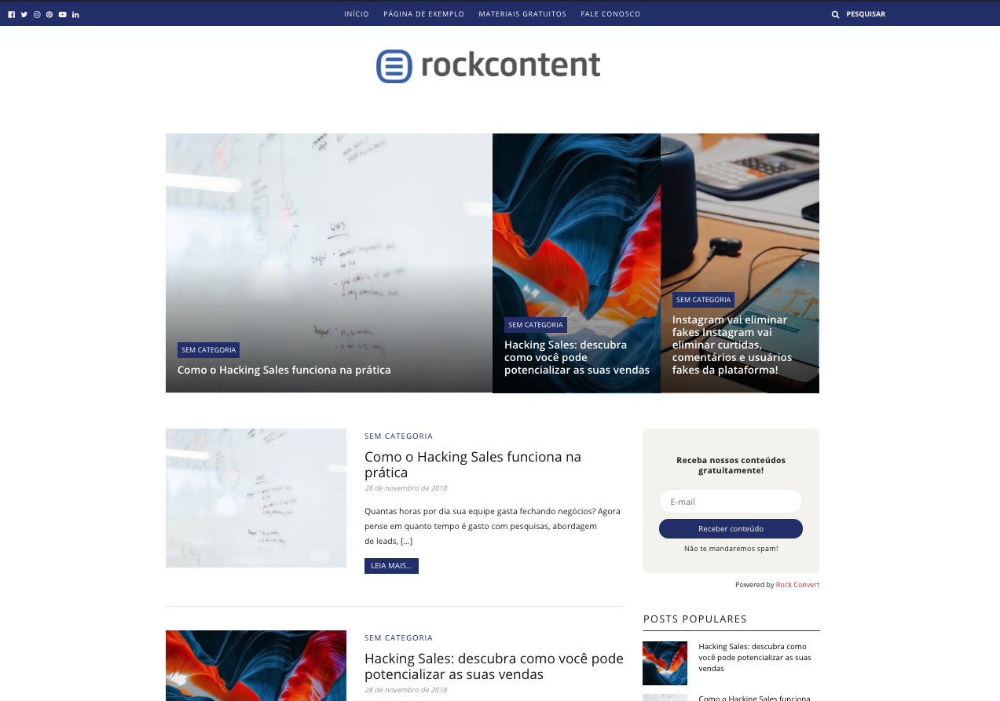

# Template 2

Template para blogs da Rock Content

### Dependência

Este tema é um child-theme.

Para instalar, antes instale o tema base [rc-wordpress-base](https://github.com/rockcontent/rc-wordpress-base)

---



## Features
1. Possibilidade de customizar as cores do tema pelo admin;
1. Materiais gratuitos;
1. Anúncios na Sidebar (Rock Convert);

## Editing
Add your own CSS styles to `/sass/theme/_child_theme.scss`
or import you own files into `/sass/theme/understrap-child.scss`

To overwrite Bootstrap's or UnderStrap's base variables just add your own value to:
`/sass/theme/_child_theme_variables.scss`

For example, the "$brand-primary" variable is used by both Bootstrap and UnderStrap.

Add your own color like: `$brand-primary: #ff6600;` in `/sass/theme/_child_theme_variables.scss` to overwrite it. This change will automatically apply to all elements that use the $brand-primary variable.

It will be outputted into:
`/css/understrap-child.min.css` and `/css/understrap-child.css`

So you have one clean CSS file at the end and just one request.

## Developing With NPM, Gulp, SASS and Browser Sync

### Installing Dependencies
- Make sure you have installed Node.js, Gulp, and Browser-Sync [1] on your computer globally
- Open your terminal and browse to the location of your UnderStrap copy
- Run: `$ npm install` then: `$ gulp copy-assets`

### Running
To work and compile your Sass files on the fly start:

- `$ gulp watch`

Or, to run with Browser-Sync:

- First change the browser-sync options to reflect your environment in the file `/gulpconfig.json` in the beginning of the file:
```javascript
  "browserSyncOptions" : {
    "proxy": "localhost/wordpress/",
    "notify": false
  }
};
```
- then run: `$ gulp watch-bs`

[1] Visit [https://browsersync.io/](https://browsersync.io/) for more information on Browser Sync
